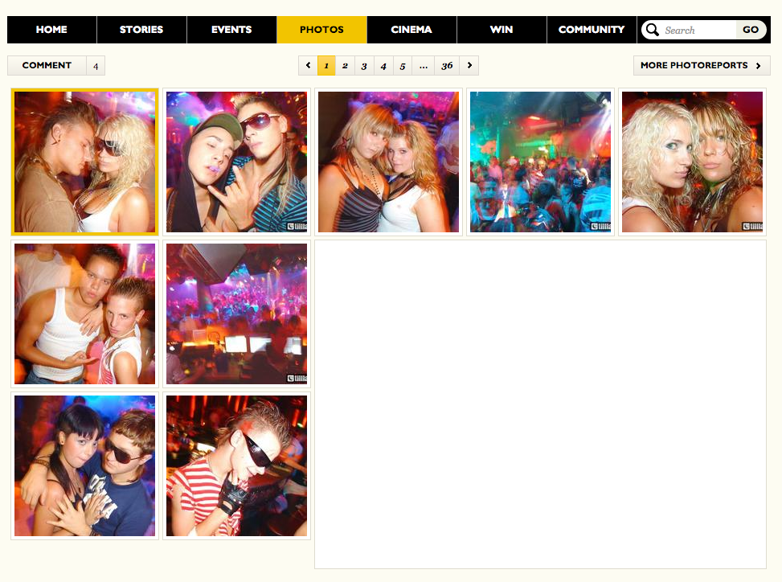
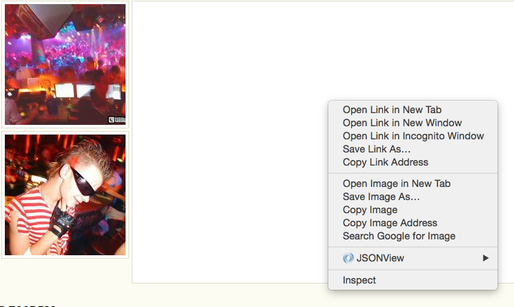
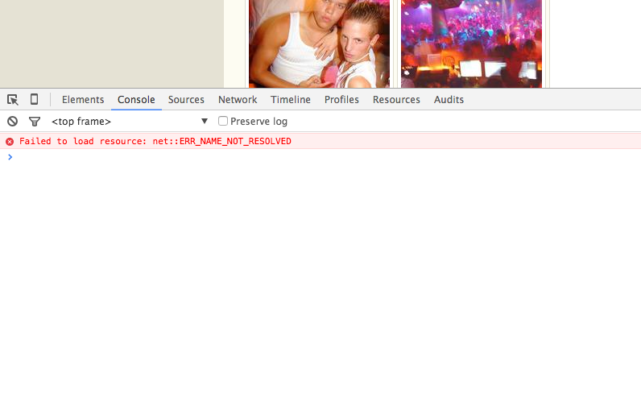
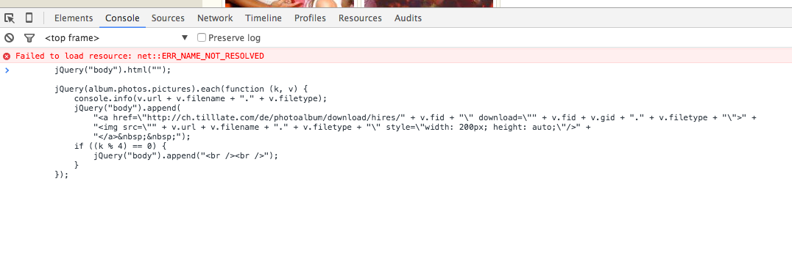
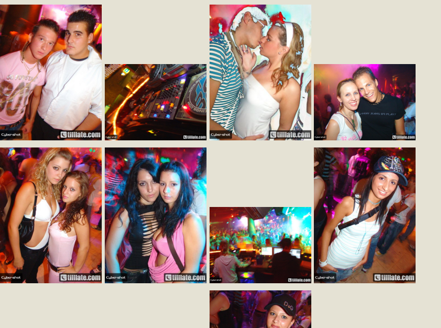
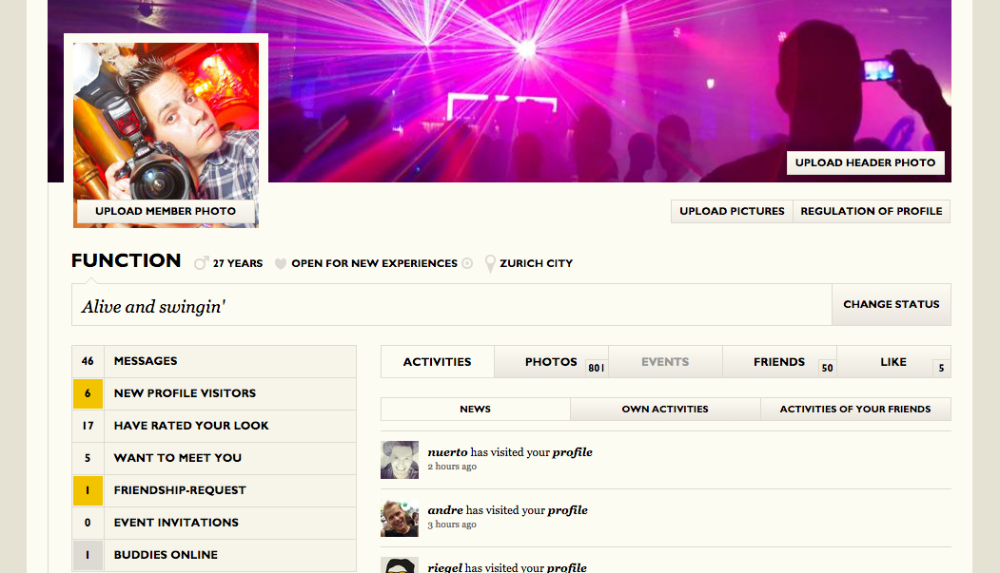

# Tillate Hires herunterladen

### [Reports](#ganze-reports-downloaden-hires)

### [Getaggte / Abgelegte Bilder](#getaggte--abgelegte-fotos-herunterladen)

## Ganze Reports downloaden (HiRes)

### 1.) Report im Browser (Chrome) öffnen

Die URL sollte so ähnlich ausshen wie diese: 

[http://ch.tilllate.com/en/photoalbum/overview/406973](http://ch.tilllate.com/en/photoalbum/overview/406973)



### 2.) Konsole öffnen

Mit einem Rechtsklick irgendwo auf die Seite das Kontextmenü öffnen, und auf **Inspect** oder **Prüfen** klicken.



Es öffnet sich ein Fenster am unteren Rand. Klickt da auf den Tab **Console** oder **konsole**.



### 3.) Script ausführen

Kopiert folgendes Script:

```javascript
jQuery("body").html("");

var hires = confirm('Bist du aktiver Fotograf (HiRes Berechtigung)?');

jQuery(album.photos.pictures).each(function (k, v) {
    if (hires) {
        jQuery("body").append(
            "<a href=\"http://ch.tilllate.com/de/photoalbum/download/hires/" + v.fid + "\" download=\"" + v.fid + v.gid + "." + v.filetype + "\">" +
            "" +
            "</a>&nbsp;&nbsp;");
    } else {
        jQuery("body").append(
            "<a href=\"" + v.url + v.filename + "." + v.filetype + "\" download=\"" + v.fid + v.gid + "." + v.filetype + "\">" +
            "" +
            "</a>&nbsp;&nbsp;");
    }

    if ((k % 4) == 0) {
        jQuery("body").append("<br /><br />");
    }
});
```

Und fügt es bei dem kleinen blauen Pfeil im Konsolenfenster ein.



### 4.) Bilder downloaden

Sobald ihr Enter drückt, werdet ihr gefragt, ob ihr aktiver Fotograf seid. Wenn ihr dies mit **Ok** beantwortet, könnt ihr die HiRes FOtos laden, ansonsten gibt die Standard-Fotos. 



Jetzt könnt ihr einfach die Bilder anklicken, die ihr downloaden wollt, und sie werden als Hires heruntergeladen.

## Getaggte / Abgelegte Fotos herunterladen

### 1.) Tilllate Meberpage im Browser (Chrome) öffnen

Die URL sollte so ähnlich ausshen wie diese: 

[http://ch.tilllate.com/en/member/function](http://ch.tilllate.com/en/member/function)



### 2.) Konsole öffnen

Mit einem Rechtsklick irgendwo auf die Seite das Kontextmenü öffnen, und auf **Inspect** oder **Prüfen** klicken.


Es öffnet sich ein Fenster am unteren Rand. Klickt da auf den Tab **Console** oder **Konsole**.


### 3.) Script ausführen

Kopiert folgendes Script:

```javascript
var memberUrlSplit = jQuery(".tlc-member-profile-picture-wrapper.tlc-member-profile-picture-wrapper-with-header a").attr("href").split("/");
var memberUid = memberUrlSplit[memberUrlSplit.length - 1];
var link = "http://ch.tilllate.com/de/photoalbum/overview/tagged/" + memberUid;

jQuery.ajax({
    url: link,
    context: document.body,
    success: function (responseText) {
        jQuery("body").append("<div id=\"response-div\"></div>");
        jQuery("#response-div").html(responseText);
        jQuery("#response-div").find("script").each(function (i) {
            eval(jQuery(this).text());
        });

        jQuery("body").html("");

        var hires = confirm('Bist du aktiver Fotograf (HiRes Berechtigung)?');

        jQuery(album.photos.pictures).each(function (k, v) {
            if (hires) {
                jQuery("body").append(
                    "<a href=\"http://ch.tilllate.com/de/photoalbum/download/hires/" + v.fid + "\" download=\"" + v.fid + v.gid + "." + v.filetype + "\">" +
                    "" +
                    "</a>&nbsp;&nbsp;");
            } else {
                jQuery("body").append(
                    "<a href=\"" + v.url + v.filename + "." + v.filetype + "\" download=\"" + v.fid + v.gid + "." + v.filetype + "\">" +
                    "" +
                    "</a>&nbsp;&nbsp;");
            }

            if ((k % 4) == 0) {
                jQuery("body").append("<br /><br />");
            }
        });
    }
});
```

Und fügt es bei dem kleinen blauen Pfeil im Konsolenfenster ein.


### 4.) Bilder downloaden

Sobald ihr Enter drückt, werdet ihr gefragt, ob ihr aktiver Fotograf seid. Wenn ihr dies mit **Ok** beantwortet, könnt ihr die HiRes FOtos laden, ansonsten gibt die Standard-Fotos. 


Jetzt könnt ihr einfach die Bilder anklicken, die ihr downloaden wollt, und sie werden als Hires heruntergeladen.
